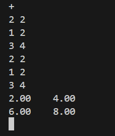
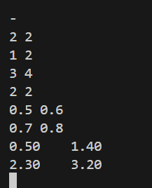
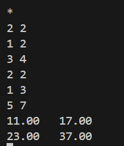
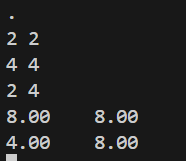
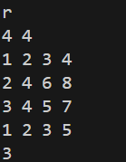
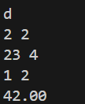
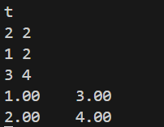
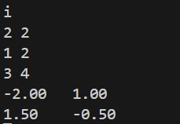

# algebra
硬件技术团队编程基础作业

## 实现思路

### 核心函数实现
1. **矩阵加减法**  
   逐元素操作，检查矩阵维度是否一致。若维度不匹配，返回错误信息。
   
2. **矩阵乘法**  
   三重循环实现，需要检查左矩阵列数是否等于右矩阵行数。

3. **矩阵转置**  
   行列交换生成新矩阵。

4. **行列式计算**  
   使用高斯消元法将矩阵化为上三角形式，对角线元素乘积即为行列式值，高斯消元法函数AI所写。

5. **逆矩阵计算**  
   构造增广矩阵后用高斯消元法，为AI所写。
6. **矩阵秩计算**  
   高斯消元法统计非零行数。

7. **矩阵迹计算**  
   对角线元素求和，仅适用于方阵。

## 本地运行截图
### 加法测试
  
### 减法测试

### 乘法测试

### 数乘测试

### 秩测试

### 行列式测试

### 转置测试

### 求逆测试
